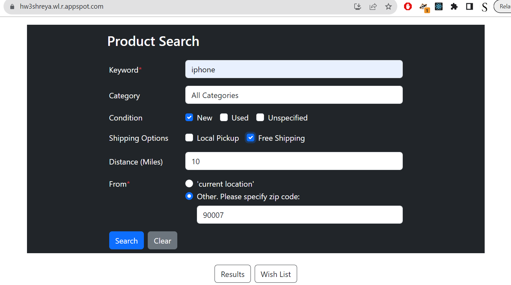
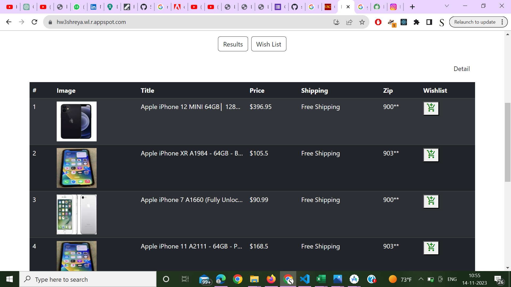
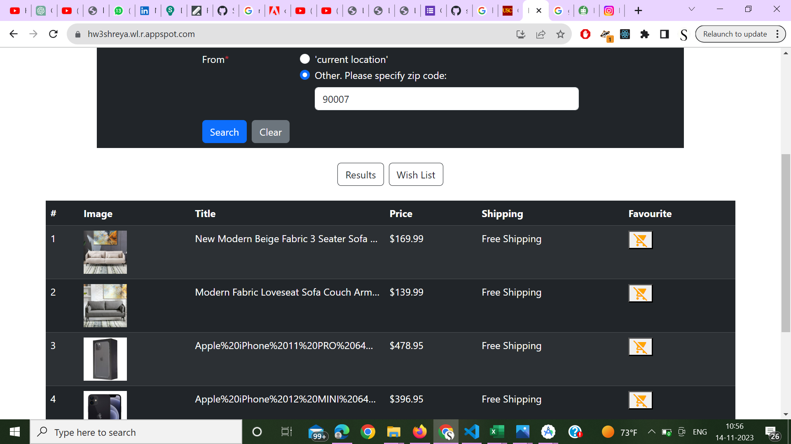
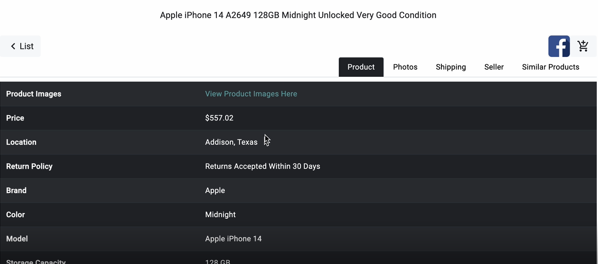
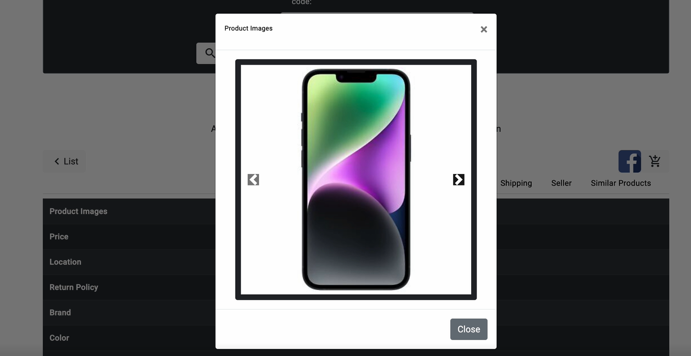
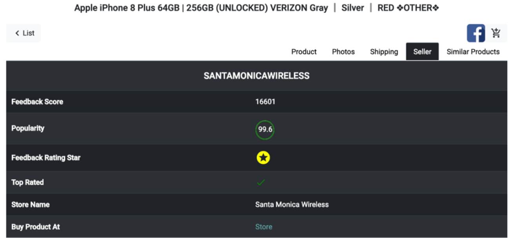
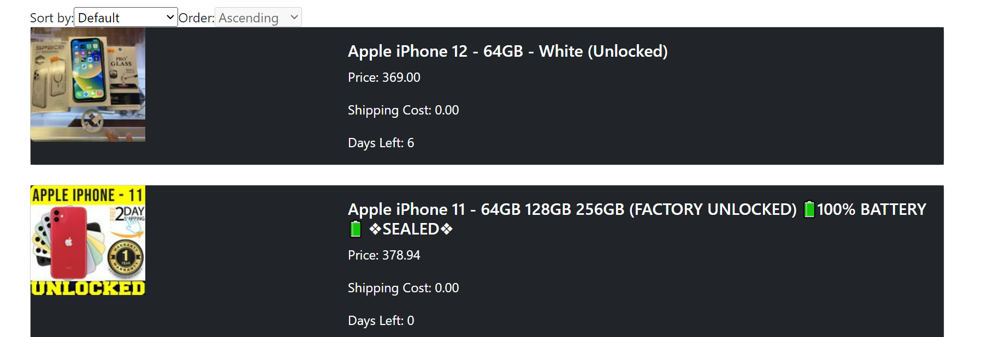

---

# **E-Commerce Web & Android App Using eBay API**
[]()  
[]()  
[]()  
[]()  

## **Overview**
This project is a **full-stack e-commerce web and Android application** that allows users to search for products using the **eBay API**, view product details, and add items to their wishlist.  
- **Web Application:** Built using **MERN stack** (MongoDB, Express.js, React, Node.js).  
- **Android Application:** Developed in **Java** with a **Node.js backend** using MongoDB.  
- **Backend:** Node.js and MongoDB are used to manage user requests, data storage, and API integration.  

---

## **Features**
### ✅ **Web Application (MERN Stack)**
- **Product Search:** Users can search for items based on keywords, category, condition, and location.  
- **Filtering Options:** Filter results based on **free shipping, local pickup, condition (new/used), and distance (miles)**.  
- **Product Listings:** Display a list of products with images, prices, shipping details, and location.  
- **Wishlist Management:** Users can add/remove products from their wishlist.  
- **Product Details:** View additional information such as seller ratings, store name, and return policies.  
- **Sorting & Pagination:** Results can be sorted based on price, relevance, and availability.  

### ✅ **Android Application (Java)**
- **Same features as the web app**, optimized for mobile experience.  
- **Smooth UI & Navigation:** Users can easily browse, filter, and manage their wishlist.  
- **API Calls:** Fetches data from the eBay API via the Node.js backend.  

---

## **Tech Stack**
### **Frontend**
- **Web:** React.js (MERN)  
- **Android:** Java (XML for UI)  

### **Backend**
- **Node.js & Express.js** (Handles API requests and user interactions)  
- **MongoDB** (Stores wishlist and user preferences)  

### **API Integration**
- **eBay API** (Fetches product details)  

---

## **Screenshots**
### **🔹 Web Application**
#### **Product Search Page**
  

#### **Product Listings**
  

#### **Wishlist Management**
  

#### **Product Details View**
  
  
  
  

---

### **🔹 Android Application**
Same Features

---

## **Installation & Setup**
### **1️⃣ Clone the Repository**
```bash
git clone https://github.com/shreyasa31/ecommerce-ebay.git
cd ecommerce-ebay
```

### **2️⃣ Install Dependencies**
#### **For Web App**
```bash
cd client
npm install
npm start
```

#### **For Backend**
```bash
cd server
npm install
node server.js
```

#### **For Android App**
- Open the project in **Android Studio**.
- Run the app on an **Android Emulator** or **physical device**.

---

## **Deployment**
- **Web App Hosted on Google Cloud (App Engine)**.
- **Backend Deployed on Heroku/Vercel**.
- **Android App can be installed via APK or Google Play Store (if published).**

---

## **Demo**
📽️ **Video Demo of the Android App**:  
[Click here to watch](https://drive.google.com/file/d/1uzsBbKHTKTgeD7yPwKmkmpY8l3v1mz_g/view?usp=drive_link)  

---

## **Future Enhancements**
🔹 **User Authentication**: Add login/signup for personalized experiences.  
🔹 **Payment Gateway**: Implement payment options for purchases.  
🔹 **AI-based Recommendations**: Suggest products based on user behavior.  

---

